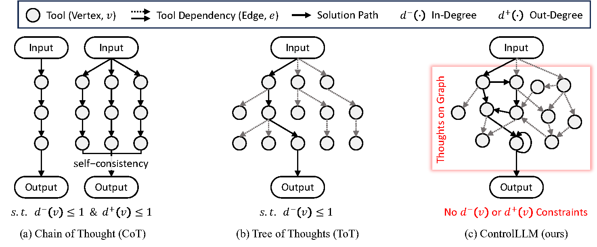
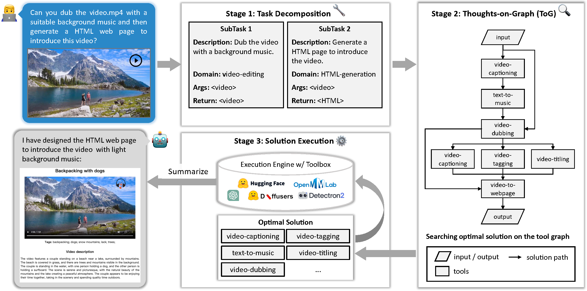
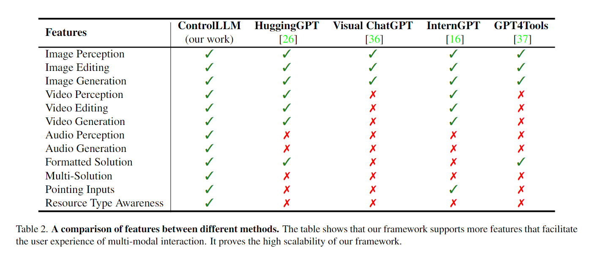

# ControlLLM [[Paper](https://arxiv.org/abs/2310.17796)] 

<!-- ## Description -->

We present ControlLLM, a novel framework that enables large language models (LLMs) to utilize multi-modal tools for solving complex real-world tasks.Despite the remarkable performance of LLMs, they still struggle with tool invocation due to ambiguous user prompts, inaccurate tool selection and parameterization, and inefficient tool scheduling. To overcome these challenges, our framework comprises three key components: (1) a *task decomposer*  that breaks down a complex task into clear subtasks with well-defined inputs and outputs; (2) a *Thoughts-on-Graph (ToG)* paradigm that searches the optimal solution path on a pre-built tool-resource graph, which specifies the parameter and dependency relations among different tools; and (3) an *execution engine with a rich toolbox* that interprets the solution path and runs the tools efficiently on different computational devices. We evaluate our framework on diverse tasks involving image, audio, and video processing, and demonstrate its superior accuracy, efficiency, and versatility compared to existing methods.

## 🤖 Video Demo


## 🗓️ Schedule

- [ ] Release code
  

## Motivation

**Comparison of different paradigms for task planning.**
<div style="text-align:center">
    
</div>

(a) Chain of Thought (CoT), CoT with self-consistency and (b) Tree of Thoughts (ToT) essentially rely on the LLMs to perform task planning, where the edge is actually formed by LLMs at run time. (c) The Thoughts-on-Graph (ToG) paradigm in our method searches for solutions on a pre-built graph that captures the dependencies of tools, which avoids the hallucination problem in tool invocation.

## 🏠 Overview

<div style="text-align:center">
    
</div>

## 🎁 Features

<div style="text-align:center">
    
</div>


## 🎫 License

This project is released under the [Apache 2.0 license](LICENSE).

## 🖊️ Citation

If you find this project useful in your research, please consider cite:

```BibTeX
@article{2023controlllm,
  title={ControlLLM: Augment Language Models with Tools by Searching on Graphs},
  author={Liu, Zhaoyang and Lai, Zeqiang and Gao Zhangwei and Cui, Erfei and Li, Zhiheng and Zhu, Xizhou and Lu, Lewei and Chen, Qifeng and Qiao, Yu and Dai, Jifeng and Wang Wenhai},
  journal={arXiv preprint arXiv:2305.10601},
  year={2023}
}
```
